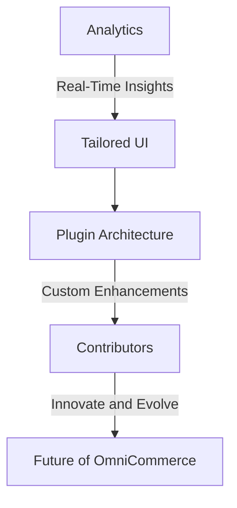

Your project introduction looks great! If you want to add more features or details to the introduction, you can consider expanding on specific aspects of the TypeScript OmniCommerce project. Here's an example of how you could introduce additional features:

---

## Continuous Innovation: Evolving the OmniCommerce Ecosystem

### Pioneering Feature: Real-Time Analytics

5. **Real-Time Analytics:**
   TypeScript OmniCommerce introduces a cutting-edge real-time analytics module, empowering businesses with live insights into customer behavior, transaction patterns, and inventory management. By seamlessly integrating with advanced data analytics tools, this feature ensures businesses stay ahead in the dynamic world of e-commerce.

### User-Centric Design: Tailoring Experiences

6. **User-Centric Design:**
   Elevating user experience to the forefront, TypeScript OmniCommerce boasts a user-centric design philosophy. Tailor-made interfaces, intuitive navigation, and responsive layouts create an immersive shopping experience. This commitment to user satisfaction positions the project as a beacon of customer-centric innovation.

### Extensibility at Its Core

7. **Plugin Architecture:**
   TypeScript OmniCommerce embraces extensibility with a powerful plugin architecture. Developers can effortlessly extend the core functionality by building custom plugins, allowing for modular enhancements. This flexibility ensures that the project can adapt to diverse business needs and evolving industry standards.

## Getting Started with the New Features

### Unveil the Power of Real-Time Analytics

1. **Enable Real-Time Analytics:**
   - Update your project configuration file to enable the real-time analytics module.
   - Explore the analytics dashboard at `http://your-omnicommerce-app/analytics`.

2. **Craft Tailored User Experiences:**
   - Dive into the user-centric design guidelines in the `docs/design` directory.
   - Leverage the provided UI components for creating delightful user interfaces.

3. **Extend Functionality with Plugins:**
   - Check out the `plugins` directory for examples and documentation on building custom plugins.
   - Contribute your innovative plugins to the growing ecosystem of TypeScript OmniCommerce.

## Embracing a Future of Commerce Excellence

### A Call to Visionaries and Contributors

As TypeScript OmniCommerce evolves, we invite visionaries and contributors to join us on this journey. Whether you're passionate about analytics, user experience, or extending functionality, your expertise is a valuable constellation in our digital cosmos.

--- 

Feel free to adapt and customize this template to highlight the specific features and aspects of TypeScript OmniCommerce that you want to introduce.